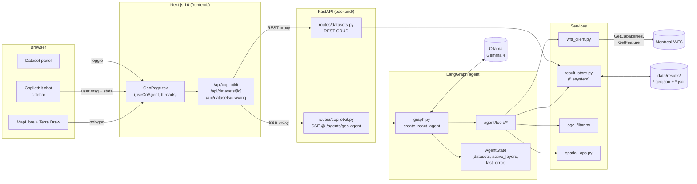
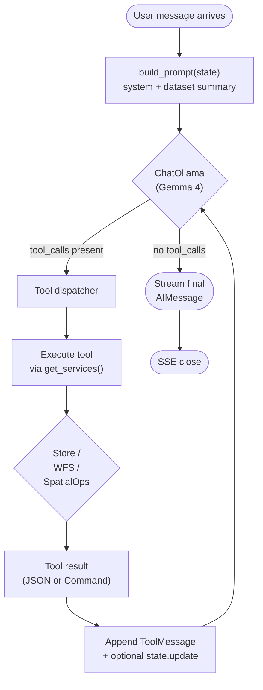
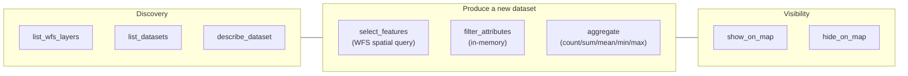
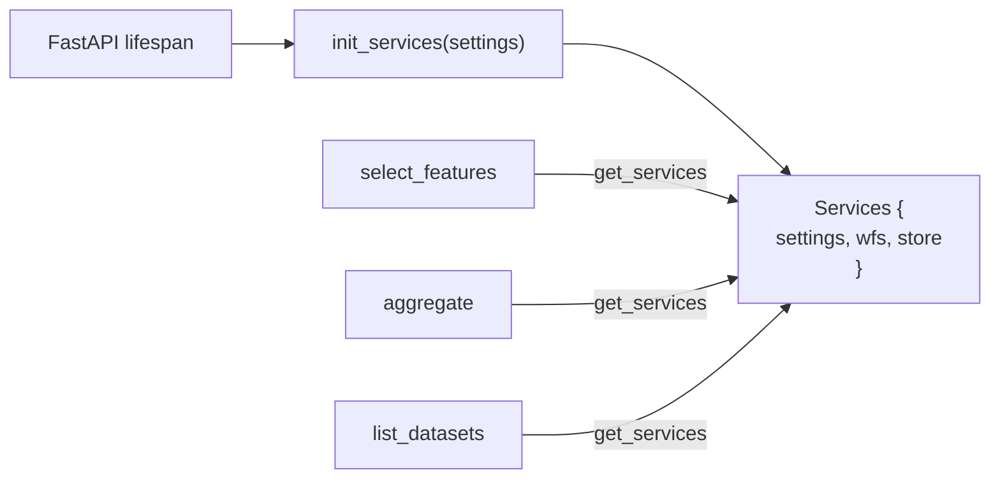
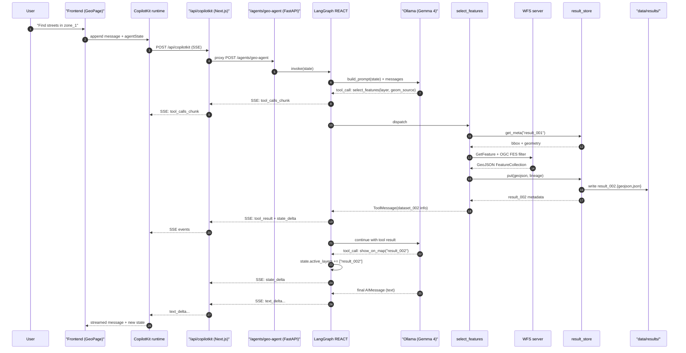
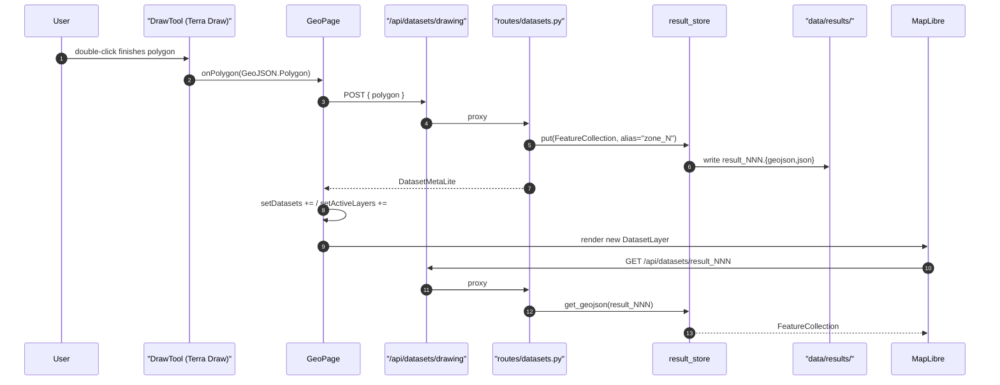
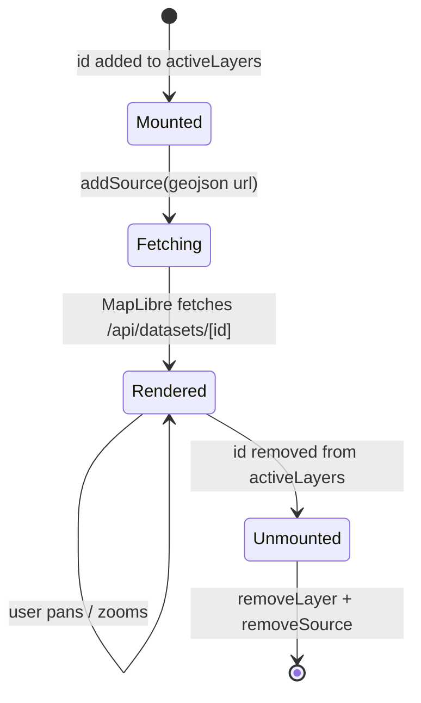
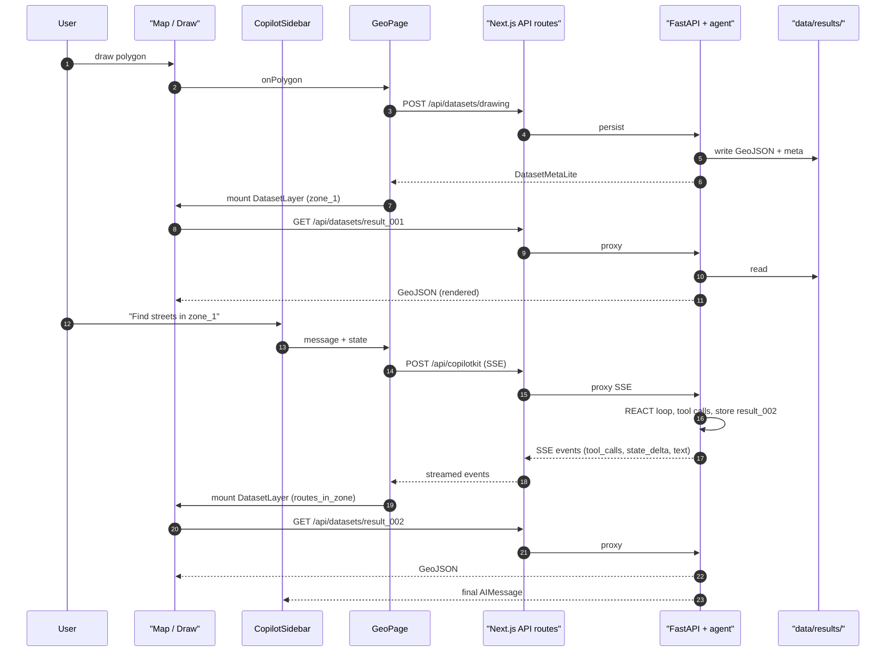

# Geo-Agent — Architecture

This document describes the architecture of **geo-agent**, a single-user web application that lets a person perform spatial analyses on Montreal's WFS (Web Feature Service) data through a conversational AI agent. The agent reasons about geographic layers, chains spatial queries, and renders the results on an interactive map in real time.

The document is organized in three layers, each with one or more Mermaid diagrams:

1. [System overview](#1-system-overview) — what the pieces are
2. [Backend tool-calling flow](#2-backend-tool-calling-flow) — how the agent invokes tools
3. [Frontend rendering flow](#3-frontend-rendering-flow) — how events become pixels

---

## 1. System overview

### 1.1 Tech stack

| Layer | Technology | Role |
|---|---|---|
| Frontend | Next.js 16 + React 19 | Routing, UI shell |
| Map | MapLibre GL + Terra Draw | Interactive map, polygon drawing |
| Agent UI | CopilotKit (`@copilotkit/react-core`, `@copilotkit/react-ui`) | Chat sidebar + agent state hooks + SSE client |
| Backend | FastAPI 0.115+ | REST endpoints + agent SSE endpoint |
| Agent runtime | LangGraph + `ag_ui_langgraph` | REACT loop, tool dispatch, state management |
| LLM | Ollama (Gemma 4, local) | Tool calling and reasoning |
| Geometry | Shapely + GeoPandas | Local geometry ops |
| Data sources | Montreal WFS server + local filesystem | Remote features + cached results |

### 1.2 Components and links



**Key idea:** the frontend never talks to Ollama or the WFS server directly. Everything goes through FastAPI, which owns the agent loop and the dataset store. CopilotKit handles the streaming protocol on top of HTTP between the browser and `/agents/geo-agent`.

**Why two hops for agent traffic?** The Next.js `/api/copilotkit` route is not a redundant proxy — it is the **CopilotKit Runtime adapter**, which translates CopilotKit's chat protocol into AG-UI requests that ag_ui_langgraph on FastAPI understands. The FastAPI endpoint itself does speak AG-UI directly (a `curl` to `/agents/geo-agent` returns a valid AG-UI SSE stream), but `@copilotkit/react-core` 1.5 always routes agent traffic through `runtimeUrl`; the `selfManagedAgents` prop was investigated and does not bypass the runtime in practice. Removing the hop would mean abandoning CopilotKit React (chat UI, hooks, threads) and rebuilding on `@ag-ui/client` directly.

### 1.3 What lives where

| Path | Purpose |
|---|---|
| `backend/geo_agent/main.py` | FastAPI app, CORS, lifespan, router mounting |
| `backend/geo_agent/agent/graph.py` | LangGraph REACT agent, tool list, ChatOllama config |
| `backend/geo_agent/agent/state.py` | `AgentState` TypedDict (datasets, active_layers, last_error) |
| `backend/geo_agent/agent/tools/` | Individual tool implementations (one file each) |
| `backend/geo_agent/agent/registry.py` | Service-locator singleton (`get_services()`) |
| `backend/geo_agent/services/result_store.py` | `FileSystemResultStore`: persists GeoJSON + metadata |
| `backend/geo_agent/services/wfs_client.py` | WFS HTTP client (GetCapabilities, DescribeFeatureType, GetFeature) |
| `backend/geo_agent/services/ogc_filter.py` | Builds OGC FES 2.0 XML filters |
| `backend/geo_agent/services/spatial_ops.py` | Local aggregate / attribute filter |
| `backend/geo_agent/routes/copilotkit.py` | Mounts SSE endpoint via `ag_ui_langgraph` |
| `backend/geo_agent/routes/datasets.py` | REST routes for listing, fetching, and creating datasets |
| `frontend/components/GeoPage.tsx` | Top-level page; orchestrates map, panel, chat, agent state |
| `frontend/components/Map/MapView.tsx` | MapLibre setup + context provider |
| `frontend/components/Map/DatasetLayer.tsx` | Adds one MapLibre source + layers per active dataset |
| `frontend/components/Map/DrawTool.tsx` | Terra Draw polygon digitizer |
| `frontend/app/api/copilotkit/route.ts` | Proxies CopilotKit traffic to backend SSE endpoint |
| `frontend/app/api/datasets/[id]/route.ts` | GET proxy to `/datasets/{id}/geojson` |
| `frontend/app/api/datasets/drawing/route.ts` | POST proxy to `/datasets/drawing` |
| `data/results/` | Persistent dataset store (`result_NNN.geojson` + `result_NNN.json`) |

---

## 2. Backend tool-calling flow

### 2.1 The agent loop

The agent is a standard LangGraph **REACT** (Reason → Act) loop wired together in `backend/geo_agent/agent/graph.py`. Each iteration the LLM either emits tool calls or produces a final assistant message; tool calls are dispatched, results are appended to the message list, and the loop repeats.



### 2.2 The tools

All tools live under `backend/geo_agent/agent/tools/` and are registered into the REACT graph in `graph.py`. They split into three families:



| Tool | Reads from | Writes to | State change |
|---|---|---|---|
| `list_wfs_layers` | WFS GetCapabilities | — | none |
| `list_datasets` | result store | — | none |
| `describe_dataset` | result store metadata | — | none |
| `select_features` | WFS + parent dataset geometry | result store (new dataset) | `datasets +=` |
| `filter_attributes` | parent dataset GeoJSON | result store (new dataset) | `datasets +=` |
| `aggregate` | parent dataset GeoJSON | — (returns scalar / groups) | none |
| `show_on_map` | — | — | `active_layers +=` |
| `hide_on_map` | — | — | `active_layers -=` |

The `show_on_map` / `hide_on_map` tools return a LangGraph `Command` rather than a plain JSON value — this is how a tool mutates `AgentState` directly so the frontend sees the new `active_layers` without an extra round-trip.

### 2.3 Where service dependencies come from

Tools never instantiate clients themselves. They call `get_services()` (`agent/registry.py`), which returns a singleton dataclass holding `settings`, `wfs`, and `store`. The singleton is initialized at app startup in `main.py`'s lifespan hook.



This keeps the tools pure functions of `(args, services) → result` and makes them trivially testable.

### 2.4 End-to-end: chat message → tool calls → SSE stream

This is the canonical path for a question like *"Find the streets that intersect zone_1"*.



A few details worth highlighting:

- **OGC filter pushdown** — `select_features` builds an OGC FES 2.0 XML predicate and lets the WFS server do the filtering. The client never pulls millions of features just to throw most away. If a query would return more than `MAX_FEATURES_PER_QUERY` (default 5000), the WFS client raises `TooManyFeaturesError` and the agent is prompted to refine.
- **Caching** — `WFSClient` caches `GetCapabilities` (1h TTL) and `DescribeFeatureType` (permanent) under `data/`. This avoids hitting the WFS server on every tool call.
- **Lineage** — every persisted dataset carries `parent_ids`, `operation`, and `params` so the chain "zone_1 → routes_in_zone → routes_in_zone_named_X" is fully traceable.

---

## 3. Frontend rendering flow

### 3.1 Two channels, one shared state

The frontend has two distinct channels into the backend:

1. **Agent channel** (CopilotKit + SSE) — chat messages, tool events, and the live `AgentState`.
2. **Dataset channel** (REST) — fetches the actual GeoJSON when the map needs to render a layer, and creates user drawings.

They meet inside `GeoPage.tsx`, which owns local React state for `datasets` and `activeLayers`. That state is mirrored to and from the agent state via `useCoAgent`.

```mermaid
flowchart LR
    subgraph FE["GeoPage.tsx"]
        Local["local state<br/>{datasets, activeLayers}"]
        Agent["useCoAgent&lt;AgentState&gt;<br/>(datasets, active_layers,<br/>last_error)"]
    end

    Chat["CopilotSidebar"] -->|user input| Agent
    Agent -->|state_delta from SSE| Local
    Local -->|effect: mirror| Agent

    Local -->|datasets| Panel["DatasetPanel"]
    Local -->|activeLayers| Map["MapView + DatasetLayer"]
    Map -->|GET /api/datasets/[id]| Backend[("FastAPI<br/>+ result_store")]
    Draw["DrawTool"] -->|polygon| Local
    Draw -->|POST /api/datasets/drawing| Backend
```

The mirroring is asymmetric on purpose: the local state is the source of truth for *what the user has done in this browser*, and `agentState` is what the LLM sees on its next turn. Without the mirror, the LLM would never know about a polygon the user just drew.

### 3.2 Drawing as dataset

A user-drawn polygon is treated like any other dataset. There is no special "user geometry" concept on the agent side — it's a result with `operation = "user_drawing"`.



The next chat message will carry this dataset in `agentState.datasets`, so the LLM can address it as `zone_1` (or whatever alias was generated) and pass it as a `geometry_source` to `select_features`.

### 3.3 What gets streamed and what gets fetched

Not everything goes through SSE. The agent state carries only **lightweight metadata** (`DatasetMetaLite`: id, alias, feature_count, bbox, layer, operation). The actual GeoJSON is pulled on-demand by MapLibre via the REST channel. This keeps SSE messages small and lets MapLibre's own caching handle re-renders.

| Carried over SSE | Fetched over REST |
|---|---|
| Streaming text tokens | Full GeoJSON for a dataset |
| Tool calls and tool results (compact JSON) | Dataset metadata (full `DatasetMeta`) |
| `state_delta`: changes to `datasets`, `active_layers`, `last_error` | User-drawn polygon (POST) |
| Final `AIMessage` | |

### 3.4 Layer lifecycle on the map

Each entry in `activeLayers` mounts one `DatasetLayer` component. The component's lifecycle adds and removes MapLibre sources/layers cleanly, so toggling a checkbox in the dataset panel produces no visual flicker and no leaked sources.



`DatasetLayer.tsx` adds three layer kinds per source — fill (Polygon), line (LineString), and circle (Point) — so a single mixed-geometry dataset renders correctly without any branching at the call site.

### 3.5 Putting it all together

End-to-end, a single user turn looks like this:



---

## 4. Notable design choices

A few decisions are worth calling out because they shape how the system behaves and how it should be extended:

1. **Results are first-class persistent datasets.** Every tool that produces geometry writes a numbered file pair (`result_NNN.geojson` + `result_NNN.json`) under `data/results/`. The agent then chains tools by referring to `dataset_id`s, never by re-fetching from the WFS.
2. **The agent state is intentionally light.** It carries `DatasetMetaLite`, never full GeoJSON. This keeps SSE traffic small and forces a clean separation: agent reasons about metadata, MapLibre fetches geometry by URL.
3. **OGC filters are pushed to the server.** Spatial and attribute filters are translated to OGC FES 2.0 XML in `services/ogc_filter.py` and executed by the WFS server. The client never holds more than `MAX_FEATURES_PER_QUERY` features at a time.
4. **Drawings are datasets.** A user polygon is stored exactly like a query result, with `operation = "user_drawing"`. This means the LLM can reason about user input and tool output uniformly.
5. **`show_on_map` / `hide_on_map` are tools, not UI commands.** They mutate `AgentState.active_layers` via a LangGraph `Command`, so map visibility is part of the agent's worldview and survives restoration of state.
6. **Local LLM by default.** The model is Ollama Gemma 4 with `temperature=0`. Swapping in another tool-calling model (e.g. `qwen2.5:7b`, `llama3.1:8b`) only requires changing `OLLAMA_MODEL` in the env file.
7. **Single-user, single-thread.** A `threadId` is held in `sessionStorage`. There's no multi-user state and no cross-tab synchronization — the model is "one analyst, one browser tab".

---

## 5. Reference: environment

Defined in `.env.example`:

| Variable | Purpose |
|---|---|
| `OLLAMA_BASE_URL`, `OLLAMA_MODEL` | Where the LLM runs and which model to use |
| `WFS_BASE_URL`, `WFS_HTTP_TIMEOUT_SECONDS` | WFS server endpoint and HTTP timeout |
| `DATA_DIR` | Root for cached WFS artifacts and persisted results |
| `MAX_FEATURES_PER_QUERY` | Hard cap on features returned per WFS call |
| `MAX_FILTER_GEOMETRY_VERTICES` | Limit on vertex count of filter geometries |
| `NEXT_PUBLIC_BASEMAP_STYLE_URL` | MapLibre style URL for the basemap |
